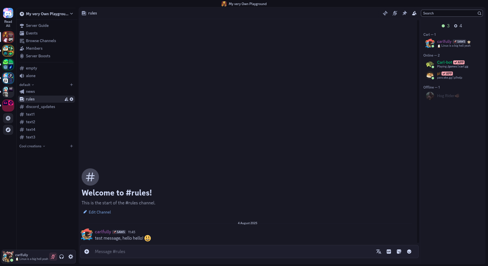
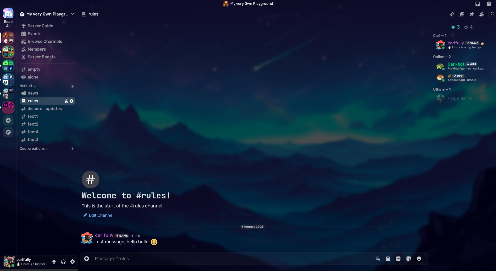
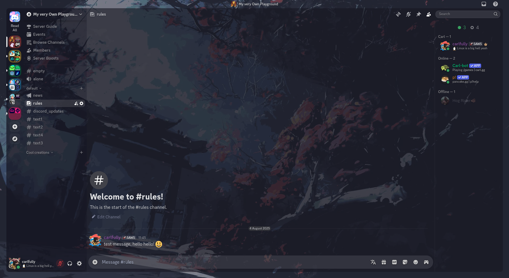

# A bunch of random custom themes I use!
Uuuh yeah that's basically the title, nothing much more to say... so here's some previews!
## ✨Previews✨
### Catppuccin
This theme is basically a fork of [catppuccin](https://github.com/catppuccin/discord) with some tint of annoyances removal and rounded corners.

### Glasscord
This is the first theme I "made", even if it actually just a slight alteration of someone else's code which I don't even understand because the comments were in russian.
On this theme, you can change the wallpaper by using any link, it's at the bottom of the code.

### Transparent
Yet again code stealing with some tweaks... but over time I'm modifying it to be more "unique".
This theme also has the wallpaper customization thing,but this time the link is on top;
for the result showed on screen, I used a png of **Catppuccin's Mocha Crust** color (#181825) at around 20% opacity.

Furthermore, the cool image shown is just my wallpaper, found at [harilvfs/wallpapers](https://github.com/harilvfs/wallpapers).

